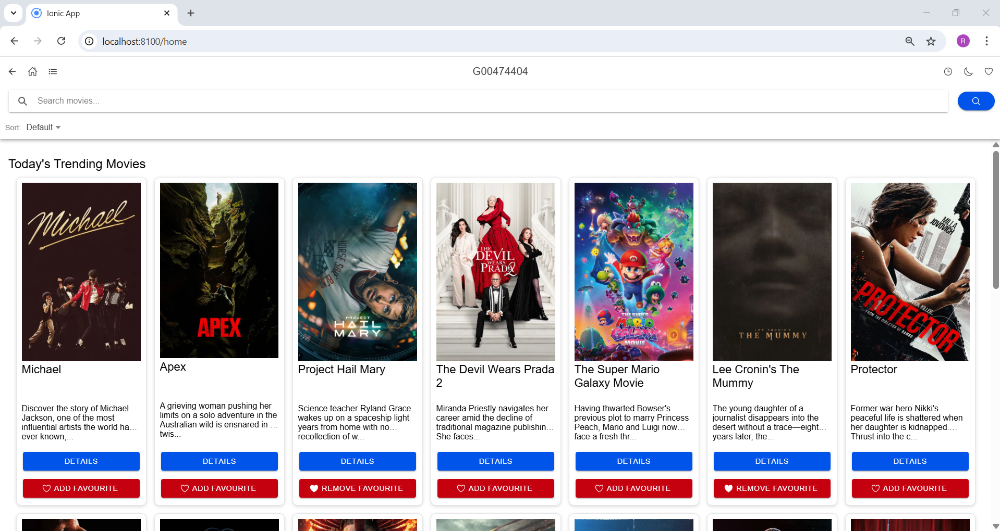
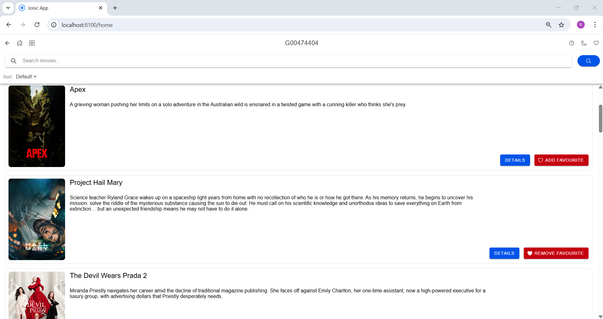
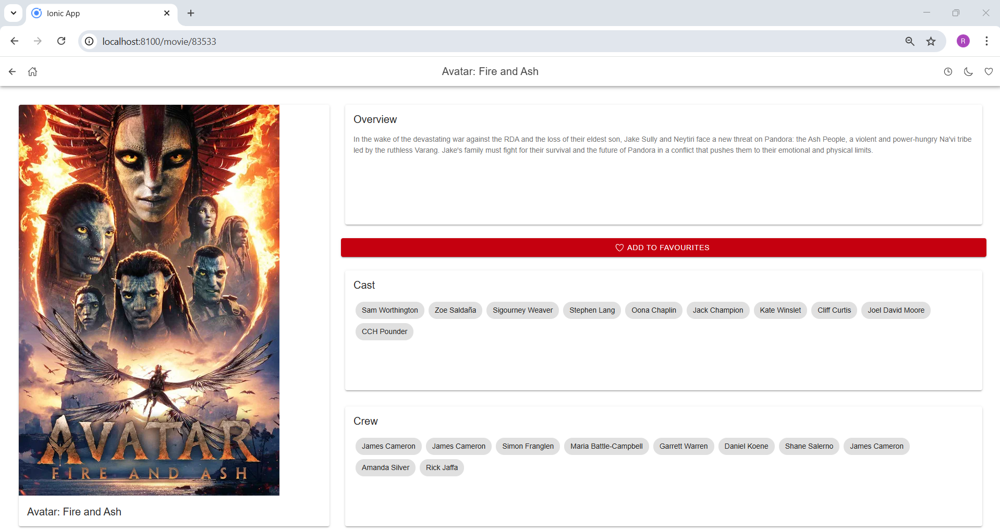
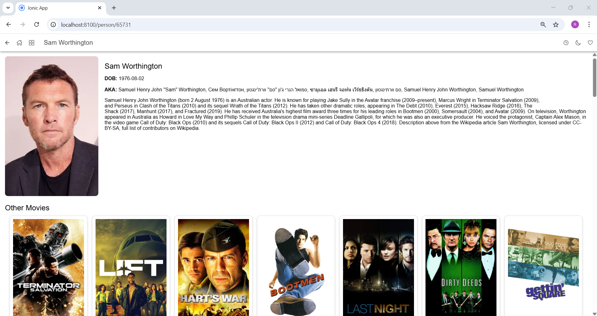
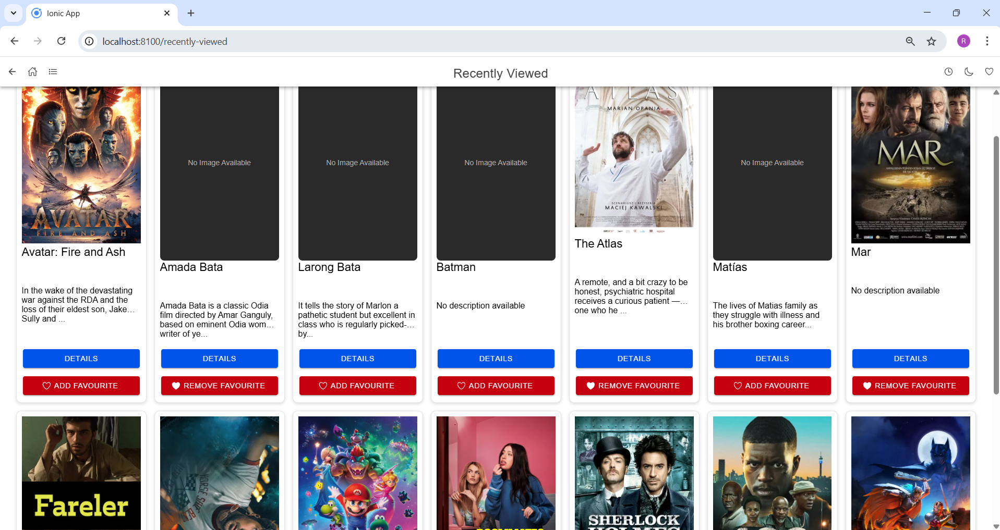
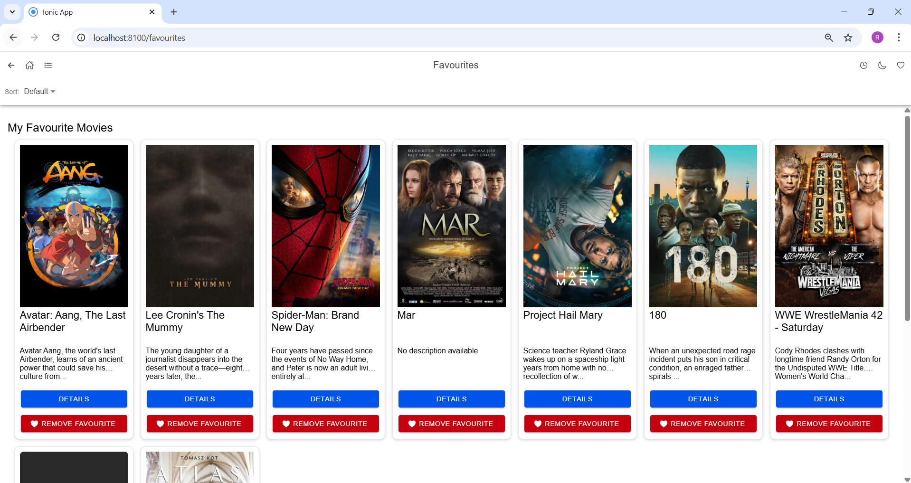
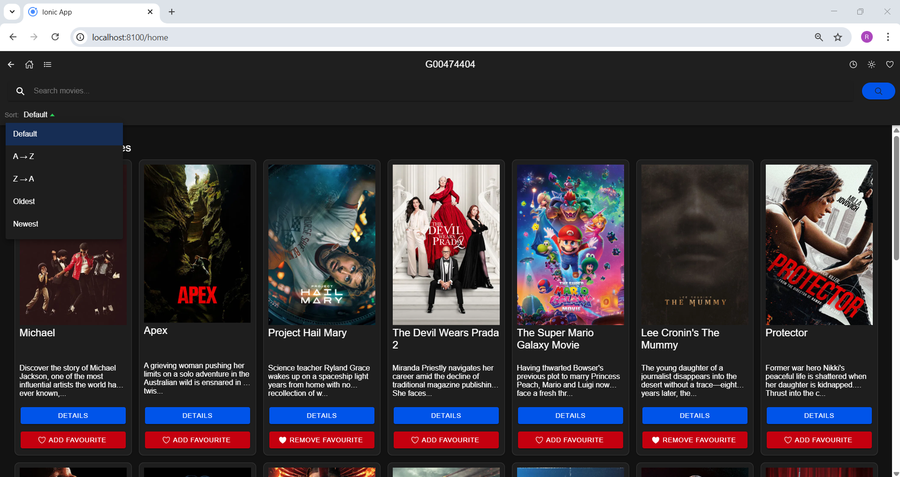

# Movie App – ATU 2026
<!--

-->


--- 

## Overview

This project is a mobile-first movie browsing application developed using Ionic and Angular as part of the Mobile Application Development module at ATU.

> The app integrates with the TMDB API to allow users to browse trending movies, search for titles, view detailed information, and manage personal preferences such as favourites and recently viewed movies.

---
<!--
## Project Walkthrough

---
-->

## Key Features

- Search Movies using TMDB API
- Trending Movies Display on homepage
- Detailed Movie View (overview, cast, crew)
- Add / Remove Favourites (stored locally)
- Recently Viewed Movies Page
- Dark / Light Mode Toggle
- Grid ↔ List View Toggle
- Responsive Design (mobile, tablet, desktop)
- Sorting Options (A–Z, Z–A, date)

---

## Technologies Used

- Ionic Framework
- Angular
- TypeScript
- SCSS (Responsive Styling & Theming)
- TMDB API (The Movie Database)
- Local Storage (for favourites & recently viewed)

---

## Images
<!-- 
### Home Page (Grid View)

*Figure 1: Home Page Layout*

### List View

*Figure 2: Movies In List View*

### Movie Details

*Figure 3: Movie Details Page*

### Person Details - Cast & Crew

*Figure 4: Person Details Page*

### Recently Viewed

*Figure 5: Recently Viewed Page*

### Favourites

*Figure 6: Favourites Page*

### Dark Mode

*Figure 7: Dark Mode Layout*
-->
---

## How to Run

- Clone the repository:
```bash
git clone https://github.com/rnolan208/Mobile_App_Development_ATU
```

- Navigate to the project folder:
```bash
cd Mobile_App_Development_ATU
```

- Install dependencies:
```bash
npm install
```

- Run the app:
```bash
ionic serve
```

- Open in browser:
```bash
http://localhost:8100
```

---

## Testing & Validation

- Tested across various screen sizes:
  - Mobile screen sizes
  - Tablet layouts
  - Desktop layouts
- Verified functionality:
  - API data loading
  - Search and sorting
  - Favourites persistence
  - Recently viewed tracking
  - Dark mode consistency
- UI tested for:
  - Responsiveness
  - Text visibility (light/dark themes)
  - Layout consistency (grid vs list)

---

## Skills Demonstrated

- Angular component architecture
- API integration & async data handling
- State management using Ionic Storage
- Responsive UI design with SCSS
- Theming (dark/light mode)
- UX design for multiple layouts (grid & list)
- Debugging Angular template & TypeScript errors

---

## Project Requirements

This project meets the core requirements of the assignment:
- Use of Ionic Framework
- API integration (TMDB)
- Multiple pages and routing
- Data persistence (favourites, recent)
- Responsive design
- User interaction features
- Clean and structured UI

---

## Project Structure

```bash
src/
│
├── app/
│   ├── pages/
│   │   ├── favourites/
│   │   ├── movie-details/
│   │   ├── person-details/
│   │   ├── recently-viewed/
│   │
│   ├── services/
│   │   ├── api.service.ts
│   │   ├── api.ts
│   │   ├── storage.ts
│
│   ├── app.component.ts
│   ├── app.routes.ts
│
├── assets/
├── theme/
│   ├── variables.scss
│   ├── global.scss
```

---

## Learning Outcomes
Through this project, I developed:

- A strong understanding of Ionic + Angular development
- Experience designing responsive mobile-first interfaces
- Knowledge of API-driven applications
- Improved debugging and problem-solving skills
- Practical experience managing UI state and user interactions

---

## Author

- Robert Nolan
- ATU Student - Software Development
- Module: Mobile Applications Development

---

## Disclaimer

This project was created for academic purposes as part of coursework.